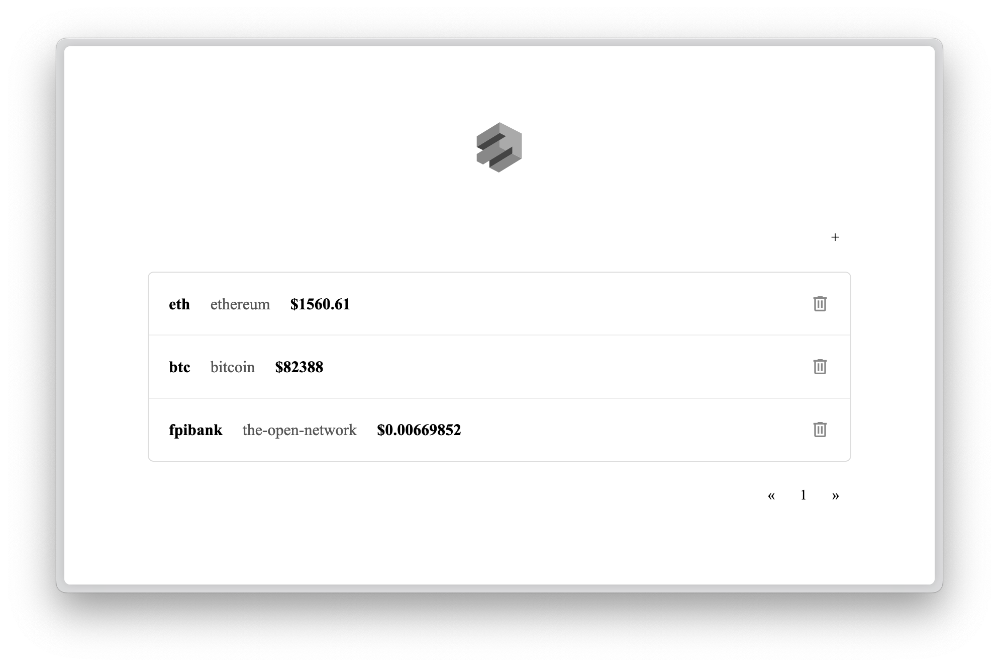

# Crypkit - Cryptocurrency Tracking Application

Crypkit is a full-stack cryptocurrency tracking application that allows users to monitor cryptocurrency prices across different platforms, featuring a minimalistic and user-friendly interface :)

## Features

- Track multiple cryptocurrencies with their symbols and platforms
- Price updates from CoinGecko API
- Add, edit, and remove cryptocurrencies from your watchlist
- Cache system for efficient API usage
- RESTful API for cryptocurrency management

## Screenshot



## Getting Started

### Prerequisites

- Python 3.8+
- Docker

### Installation

1. Clone the repository
```bash
git clone https://github.com/rr3333mmAA/crypkit.git
cd crypkit
```

2. Run the application
```bash
docker-compose up -d
```


## Usage

1. Open your browser and navigate to `http://localhost:8000`
2. Use the '+' button to add new cryptocurrencies
3. Click on any cryptocurrency's symbol or platform to edit it
4. Use the delete button to remove cryptocurrencies

## Future Improvements

### Backend
- Scheduled price updates using Celery/APScheduler
- Expand to include historical price data

### Frontend
- Make "platform" selectable from available options
- Implement responsive design for mobile devices
- Add price change indicators (up/down)
- Dark mode toggle

### Refactoring
- Move environment variables into separate file (e.g., config.py)